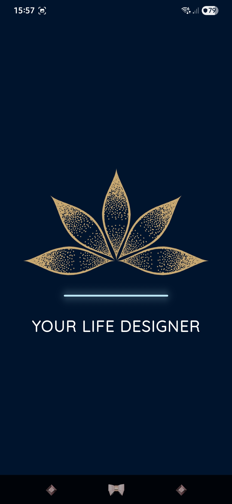
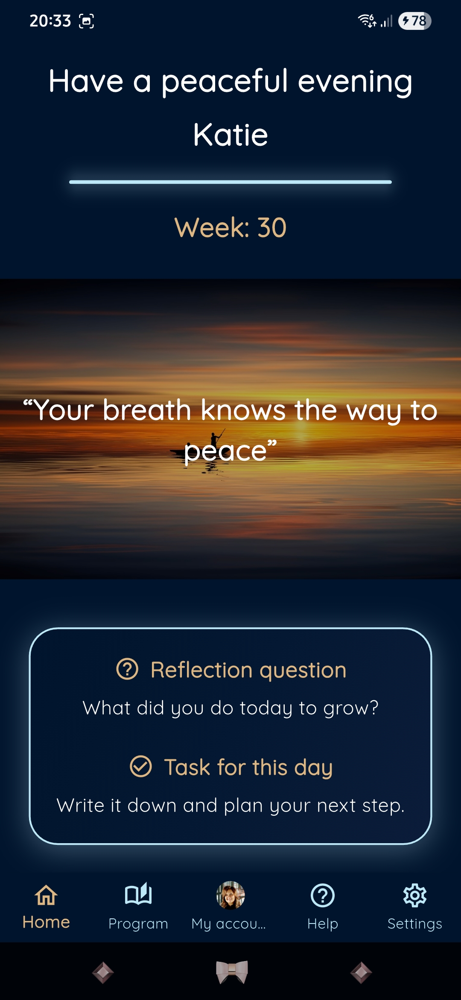
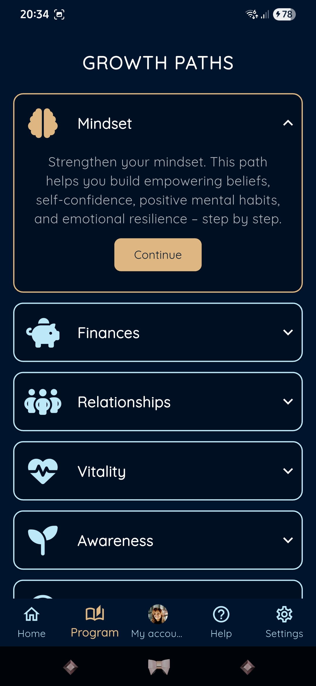
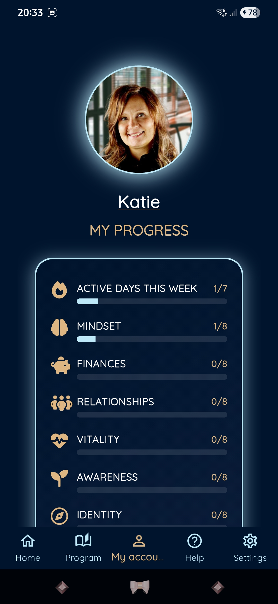
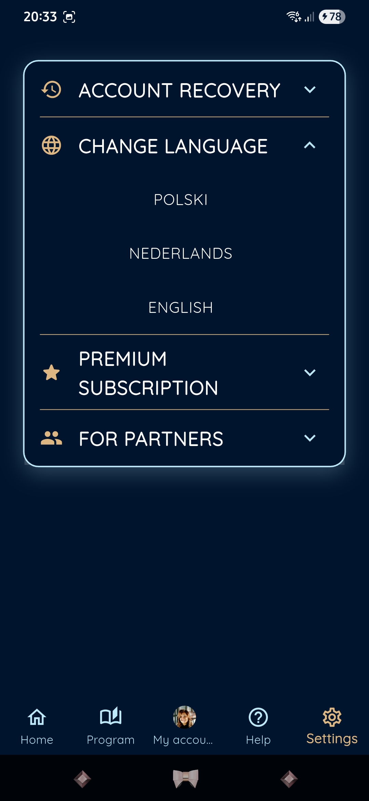
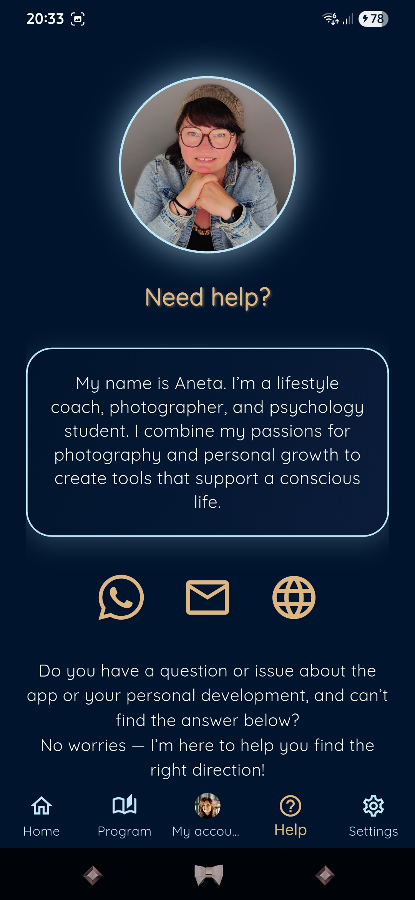

# -Maykay-
Maykay is a Flutter-based mobile app for a massage studio in the Netherlands. It offers booking, pricing, a loyalty program, and multilingual support (PL/EN/NL). With Firebase push notifications and an AI assistant for massage advice, the app helps clients discover services, enjoy promotions, and experience modern cross-platform UX design.

## ✨ Features

- Personal growth paths – structured programs in mindset, finance, health and more.  
- Progress tracking – statistics and weekly completion overview.  
- Partner & recovery codes – secure account recovery and partner access.  
- Subscription system – freemium model with monthly and yearly plans.  
- Multilingual support – Polish, English, and Dutch.  
- Push notifications – reminders and motivational messages powered by Firebase.  
- Unique UI/UX – deep navy colors, modern pastel design, and intuitive navigation.  
- Cross-platform – developed in Flutter for Android and iOS.

- 
## 📱 Screenshots

| Splash | Home | Program |
|--------|------|---------|
|  |  |  |

| Account | Settings | Help |
|---------|----------|------|
|  |  |  |
